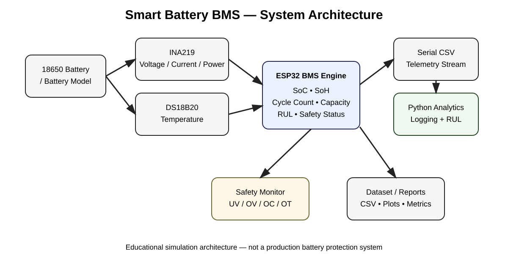
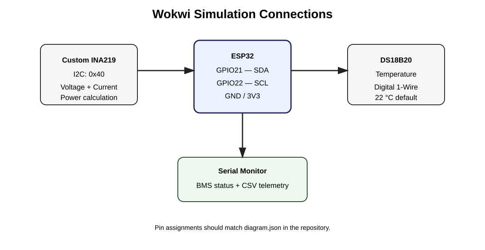

# System Architecture

## Embedded layer

The ESP32 periodically reads:

1. INA219 bus voltage
2. INA219 load current
3. Calculated electrical power
4. DS18B20 temperature

The BMS engine then calculates SoC, SoH, accumulated charge, equivalent full cycles, available capacity and RUL.

## Safety layer

The simulation uses conservative thresholds:

- Under-voltage: `< 3.00 V`
- Over-voltage: `> 4.20 V`
- Over-current: `> 1000 mA`
- Over-temperature: `> 45 °C`

## Degradation model

The available capacity is modeled from SoH:

`available_capacity = nominal_capacity * SoH / 100`

The nominal life is 400 equivalent full cycles and the estimated RUL is:

`RUL = max(0, nominal_life - cycle_count)`

SoH is reduced by a small cycle-aging factor in the simulation. This is intentionally deterministic so the system can be demonstrated and tested without a real battery aging dataset.

## Visual diagrams

### System architecture

### Wokwi connections

### Telemetry data flow

### SoH and RUL prediction flow

